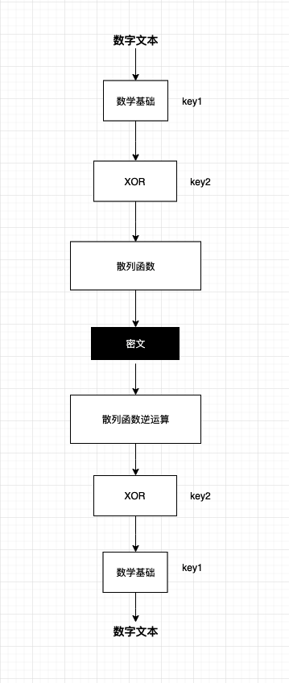

# AlgebraCrypt
AlgebraCrypt : Random reversible encryption from integer to hash value

## 介绍
从整型到字符散列值的随机可逆加密

## 特性

- 可逆且随机
- 可定制性
- 安全性

## 加/解密过程

## 数学原理

1. XOR 异或运算（ 文本 ^ key ^ key = 文本 ）

2. 辗转相除法

3. 质数 / 同余 / 整除 / 无理数 /

4. 凯撒密码数学公式 En(x) = (x+n) mod 26 , Dn(x)=(x−n)mod26 . En为加密方法, Dn为解密方法

5. 散列函数 ( Hash 算法 )

6. 矩阵加密

## 参考

[查看参考](./reference/README.md)

