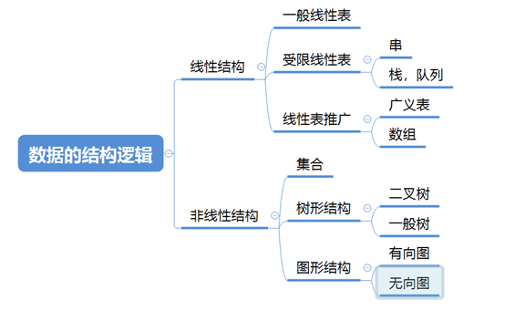

# 如何快速想起所有的数据结构类型？

 
 

<br>

## 数据结构的2种分类

### 一、前言

  1. 数据的逻辑结构分为称为线性和非线性就OK了，不要叫```(非)线性结构```, 因为上面的```逻辑结构```已经包含```结构```
     ，就不要再多此一举，免得让人感觉混乱。

  2. 为什么线性中的那些类型都叫做表呢 ？ 因为```线性```顾名思义表示的就是像一条线一样，```表```
     顾名思义表示的意思是行货列，总之都是线性的，故将二者联合起来用于表示计算机中的线性存储。

### 二、数据的逻辑结构

#### 1. 线性

  - ##### 一般线性表

  - ##### 受限线性表
    
    - 栈和队列
      
    - 串
    
  - ##### 线性表的推广
  
    - 数组
    
    - 广义表

#### 2. 非线性
  
  - ##### 树型
  
  - ##### 图状

### 三、数据的物理结构

这个就没什么好说的了，内存都是一个单元一个单元紧挨着的，分为：```连续存储```和```不连续存储```。也就是说数据的物理结构分为```顺序存储```和```链式存储```。
