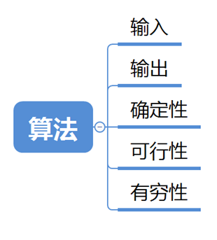

# 算法和算法分析



## 算法的5个重要特性

1. 有穷性
2. 确定性
3. 可行性
4. 输入
5. 输出

## 算法设计的要求

1. 正确性
2. 可读性
3. 健壮性
4. 效率与低存储量需求

## 算法效率的度量

### 时间复杂度

一般情况下，算法中基本操作重复执行的次数是问题规模 n 的某个函数 f(n)。

算法的时间度量记作： ```T(n) = O( f(n) )``` 。它表示随问题规模 n 的增大，算法执行时间的增长率和 f(n) 的增长率相同，称作算法的**渐进时间复杂度**，简称**时间复杂度**。

常见的时间复杂度为：

### 空间复杂度

```S(n) = O( f(n) )```

