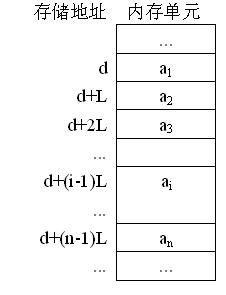

# 线性表的顺序结构 ( 数组 )

## 介绍
线性表的顺序表示指的是**用一组地址连续的存储单元**依次存储线性表的数据元素。

## 例题

原链接来自牛客 [点击查看](https://www.nowcoder.com/questionTerminal/cc26b40642344f6991cb602d31446812) 。

线性表的顺序存储结构是一种( **A** )
A. 随机存取的存储结构
B. 顺序存取的存储结构
C. 索引存取的存储结构
D. Hash存取的存储结构

解题 ：

1. 顺序存储指内存地址是一块的，随机存取指访问时可以按下标随机访问。存储和存取是不一样的

2. 线性表有两种存储结构：
    - 顺序存储结构---顺序表。顺序表以数组形式出现，可以取任意下标访问，所以是一种随机存取的存储结构。
    - 链式存储结构---链表。链表以链表的形式出现，必须从头开始访问，所以是一种顺序存取的存储结构。