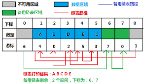

# 静态链表

## 介绍
静态链表就是用数组描述的链表，静态链表由**数据域**和**游标**构成。

为了和指针型描述的线性链表相区别，故这种**用数组描述**的链表称为**静态链表**。

## 例题

原链接来自牛客 [点击查看](https://www.nowcoder.com/questionTerminal/53a4342ac98f491bb0e8691890182e44) 。

静态链表中指针表示的是( **C** )
A. 下一元素的地址
B. 内存储器的地址
C. 下一元素在数组中的位置
D. 左链或右链指向的元素的地址

解题 ：

- 用 **数组** 描述的 **链表** ，即称为静态链表。
在C语言中，静态链表的表现形式即为结构体数组，结构体变量包括数据域data和 游标 CUR。指针指向下一个数组元素的位置
- 用数组描述的链表即静态链表，静态链表由**数据域**和**游标**构成。