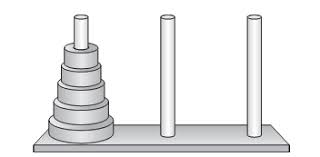

# 汉诺塔问题



## 问题描述
要求将X轴上的n个圆盘移至塔座Z上并按同样顺序叠排，圆盘移动式必须遵循下列规则：
(1) 每次只能移动一个圆盘；
(2) 圆盘可以插在X、Y和Z中的任一塔座上；
(3) 任何时刻都不能将一个较大的圆盘压在较小的圆盘之上。

## C伪代码

```c

// 将塔座 x 上按直径由小到大且自上而下编号为 1至n 的 n个圆盘按规则搬到塔座 z 上，y可用作辅助塔座。
// 扳动操作 move(x, n, z) 可定义为( c 是初值为 0 的全局变量，对搬动计数 ) ：
// printf("%d Move disk %d from %c to %c\n", ++c, n, x, z);
void hanoi(int n, char x, char y, char z){

    if(n==1){

        move(x, 1, z);
    }else{

        hanoi(n-1, x, z, y);
        move(x, n, z);
        hanoi(n-1, y, x, z);
    }
}
```
