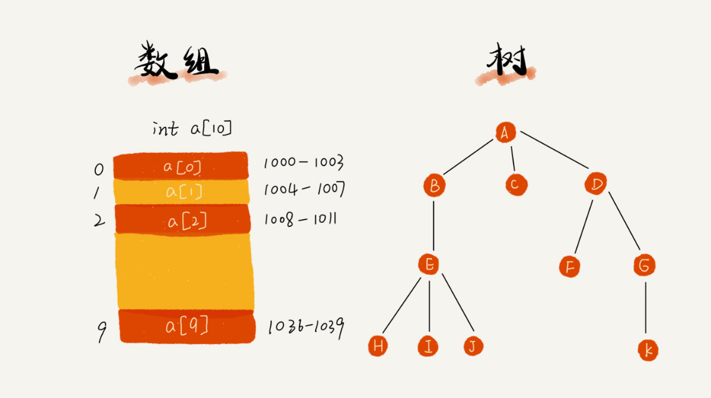

# 数组的定义




## 介绍

数组和广义表可以看成是线性表在下述含义上的扩展：表中的数据元素本身也是一个数据结构。

## 定义

```c
ADT Array{

    数据对象：
    数据关系：

    基本操作：

    InitArray( &A, n, bound1, ..., boundn )
    DestoryArray( &A )
    Values(A, &e, index1, ..., indexn)
    Assign(&A, e, index1, ..., indexn)
} ADT Array
```


