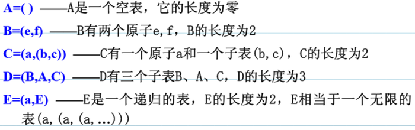
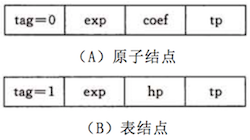

# 广义表的存储结构





## 介绍

由于广义表( a1, a2, ..., an )中的数据元素可以具有不同的结构( 或是原子，或是列表 )。因此难以用顺序存储结构表示，通常采用链式存储结构，每个数据元素可用一个结点表示。


## 定义

```
typedef enum {ATOM, LIST} ElemTag;
typedef struct GLNode {

    ElemTag tag;

    union{

        AtomType atom;
        struct { struct GLNode *hp, *tp; } ptr;
    }
}
```


