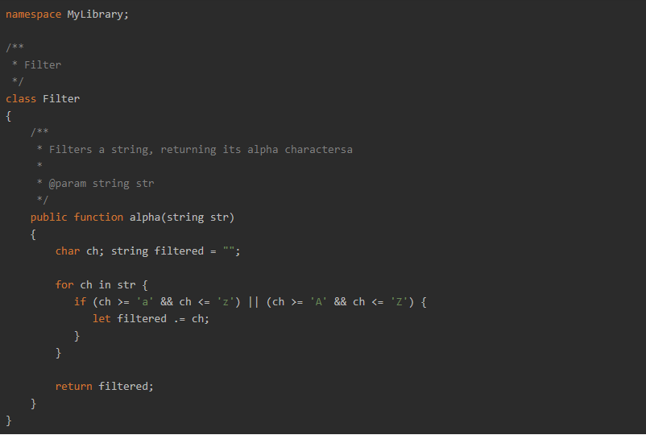

# Drummer
Drummer：用于解析Markdown的PHP扩展（Drummer：A PHP Extension for Parsing Markdown ）

## ★ PHP扩展开发

[查看教程](./docs/PHP扩展开发/README.md)

## ☑ Markdown解析原理

1. 了解普遍的Markdown都支持什么语法
2. 针对不同的Markdown语法编译优化并解析为HTML文本
3. 所得的HTML文本即是最后的结果

#### 供以参考

- [HyperDown](https://github.com/SegmentFault/HyperDown)
- [MultiMarkdown-5](https://github.com/fletcher/MultiMarkdown-5)
- [markdown 编译原理](https://segmentfault.com/a/1190000006730986)
- [实现一个markdown解析器需要具备那些知识？](https://www.zhihu.com/question/28756456)

## ☑ 关于Zephir



Zephir是 Phalcon 团队下的一个开源产品，旨在为PHP开发者提供一种简单快捷的方式开发PHP扩展 。

Zephir是一种动态静态结合的运行在Zend引擎下的编译类型的语言，语法和PHP有很大的相似之处，适合PHP程序员使用。

## ☑ 关于Windows+Zephir

对我来说，特别是 Windows 系统，安装环境似乎一直都是个深不可测无底洞。Zephir也不例外，本项目开始的时候，由于本地电脑未配置 Zephir 环境，我只能先配置环境，可是Zephir目前看来过于小众，安装中出现了很多问题，Google只能搜到屈指可数的解决方案，而且对我还没用。于是我光安装配置环境都花了快1天，而且还没弄好。。。

所以我暂时放弃 ```windows+Zephir``` 了。

