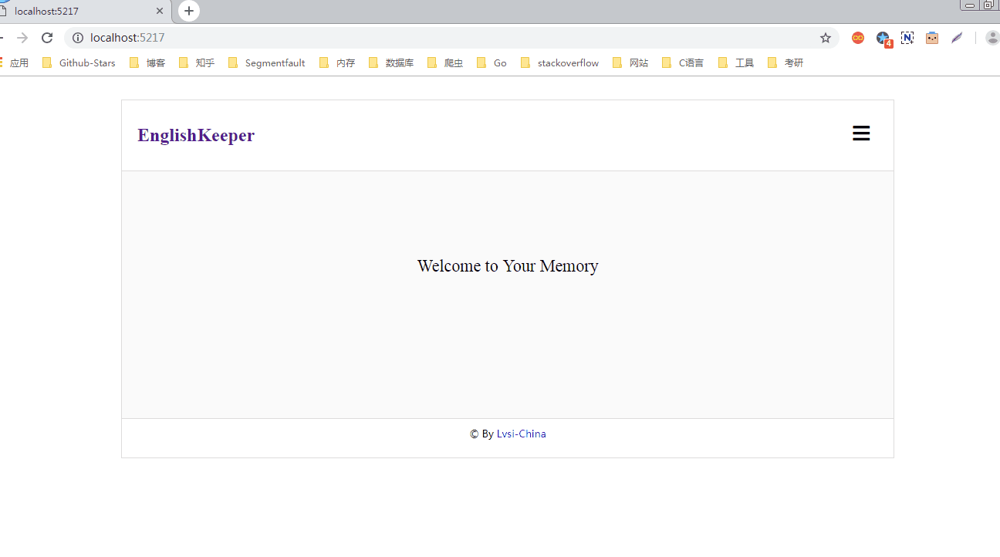
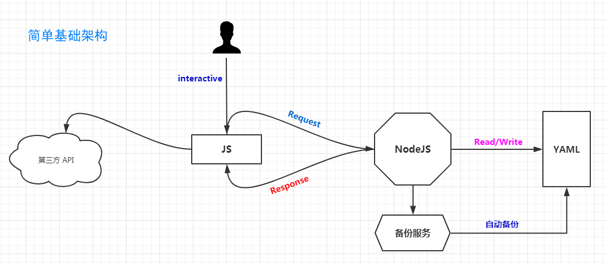
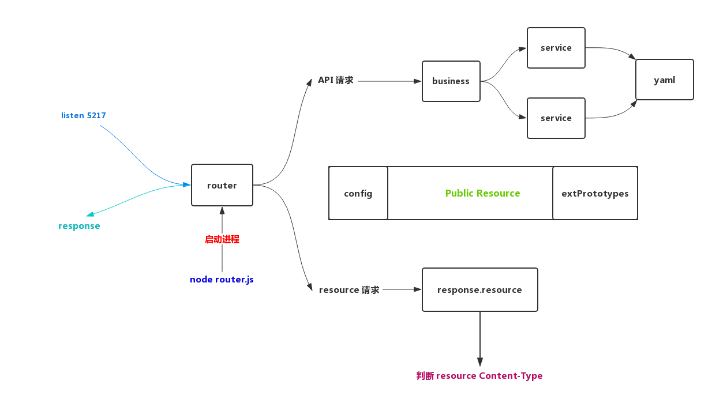

# EnglishKeeper

英文守护者：基于NodeJS的管理个人英文学习的Web工具（EnglishKeeper Manages Personal English Learning for You based on NodeJS），[立即使用](#usage)

## ✎ 摘要



## ♨ 介绍

我使用过很多种英语单词APP，但没有一个APP可以在我手机中活过1个月，自己以前记录的单词也全部都没了。而且自己的“英文词库”和“知识库”可能每天都在更新，只是我未曾注意到而已。 后来我就想到为什么要让他们存储我的单词库呢？所以，项目的初始目的只是为了永久性的存储我个人的英文词库，并且在我想回顾的时候自动朗读所有的单词(当然还有其他的功能)，以加深记忆。 由于并没有其他的目的，再加上时间有限，所以项目会比较粗糙，不过我之后会不断更新的。

## <span id="usage">♗ 使用</span>

> 1. 下载此项目到本地
> 2. 确定本地已经配置了 Nodejs 环境，然后开启本项目的 Nodejs 服务。
> 3. 切换到 /src/api/ 目录下，执行 ```node router.js```即可开启服务。
> 4. 打开浏览器，前往 ```http://localhost:5217/``` 即可。

> 我设置的监听的端口是 ```5217``` ，你也可以修改监听端口。 

## ✧ 英文学习

目前主要是针对英文词汇，短语和句子的记录和学习。当然如果在后期学习中有新的发现的话，会及时更新。

## ✪ 功能特性

### vocabulary 单词库
 
 - A-Z的单词属于不同的词库
 - 获取单词库并自动朗读
 - 添加单词
 - 删除单词
 - 单词云

### phrase 短语库
 
 - A-Z的短语属于不同的短语库
 - 获取短语库
 - 添加短语
 - 删除短语

注：```功能会在我的使用中不断完善更新。```

## ☑ 注意事项

1. 不要直接修改 ```.yaml``` 文件，因为这是作为数据存储的，虽然本项目有自动备份功能，但还是不要直接操作 ```.yaml``` 文件。
 
## ✪ 关于备份

1. 自动备份功能是自动由 Nodejs 服务启动的，我们完全不用去管理。
2. 备份的数据和yaml数据都存储在```/src/server/database```文件夹中。

## ✣ 项目结构

#### 架构总览



在传统交互上，使用 Nodejs 作为服务，数据存储在 yaml 文件中(没错，不使用数据库作为持久存储)。很简单的一个经典B/S架构，并没有使用什么创新的技术。所以，技术没什么好说的，翻来覆去还是那几样，万变不离其宗，至于第三方API，这个更简单，很多公司都有对外提供API。简言之，此项目真的很简单，没什么东西，一切都是以最简单的方式去实现的，因为这只是为了方便自己学习英文而已，并不是为了体现技术水平。把技术作为工具，在合适的时候帮助我，仅此而已。

#### NodeJS架构



由于业务简单，为避免过度封装，故以至简的风格设计。

## ◑ 用途

仅用于个人使用。


