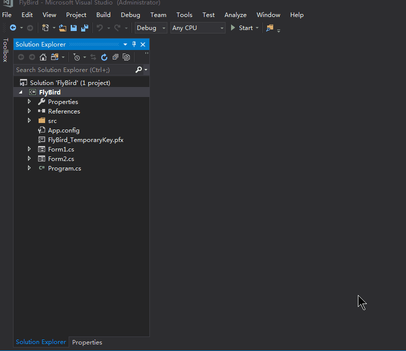

# FlyBird

<p align="left">


</p>

基于C#的windows平台小游戏FlyBird（FlyBird Game Based on C# on Windows）

## ✎ 摘要



###### 此动图中分数有突变的原因是：删除了部分重叠的图片帧，减少图片大小

## ♨ 介绍

基于 C# Windows Forms 开发的 Windwos 小游戏。虽然 Windows Forms 看似已逐渐被 WPF 代替( 虽然看似 WPF 也逐渐被替代 )，不过对于初学者，我觉得都还是有必要熟悉一下的，而且也不会耗费很长时间。

## <span id="usage">♗ 使用</span>

> 1. 下载此项目到本地
> 2. 使用 ```Visual Studio``` 打开 ```/WindowsForm/src/FlyBird.sln``` 文件
> 3. 打开以后可以自己修改代码然后调试即可，当然也可以自己 ```publish```

## ✪ 游戏说明

- 使用 ↑ ↓ 控制小鸟飞行，飞行时间越长得分越高 。
- 场景自动随机变换，分为白天黑夜。

## ☑ 关于 WPF 版

总体来说，WPF 和 WindowsForm 差不太多，不过 WPF 版本的代码还是有必要看一下的。

## ☑ 关于 C\#

C# 本身是一门非常优秀的语言，但是在国内，似乎都被 Java 抢了风头。不过还是觉得 C# 作为一门优秀的语言非常值得学习。

C# 很多时候确实扮演着像 JavaScript 一样的角色( 这么介绍的话很多对C#不了解的人就会豁然开朗 )，不过C#不限于此。