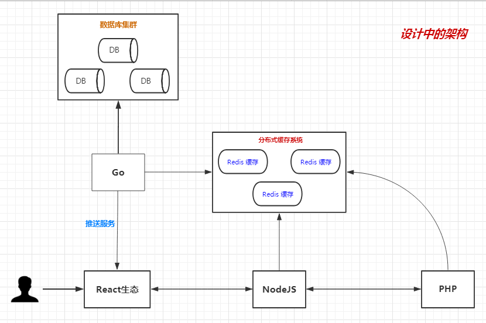

# Mordor
Mordor：把想用的技术运用到实践中（Mordor：Applying Any Technology I Want Which to Practice）

## 介绍



目前，项目还在规划中，此图只是一个简单的基本设想而已，表达想要使用 ```React```, ```NodeJS```, ```PHP```, ```Go```, ```分布式缓存``` 这几个基本的工具来构建这个项目，当然工具还不止这些，只是先上这几个而已，先上图，防止以后忘记。

<!--CSPAPER-->
