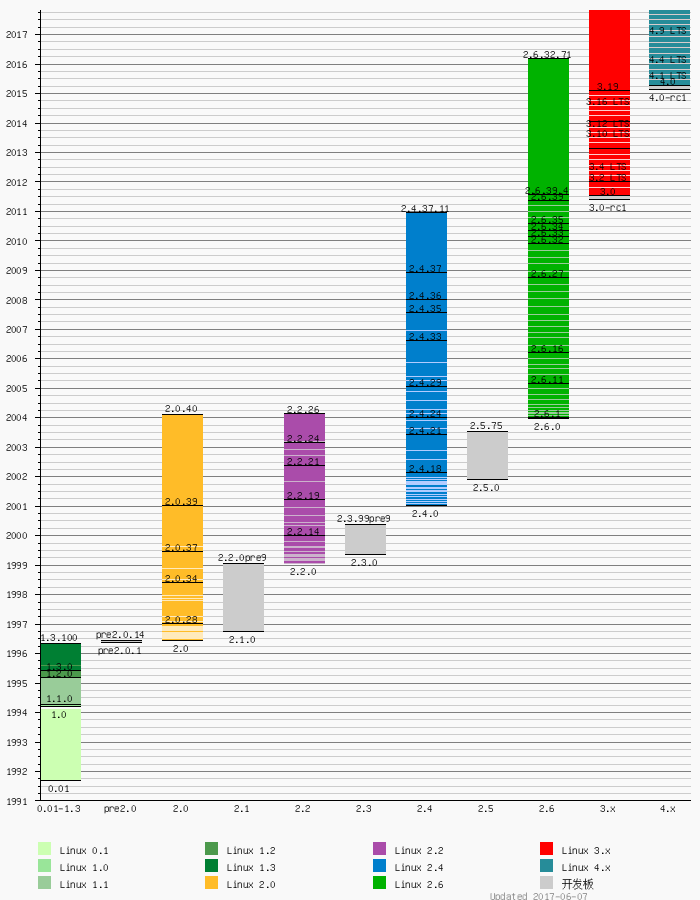

# NarniaOS
操作系统的简单实现（A simple implementation of an OS）.

## 介绍（Introduction）
Linux作为优秀的开源操作系统，其最早期版本(0.11)非常值得学习，故此项目是以Linux的0.11版本为最重要的基础，在学习和研究此版本的代码基础上加以自己的想法和设计而实现的。

## 附录

[Linux 内核的版本图](https://zh.wikipedia.org/wiki/Linux%E5%86%85%E6%A0%B8#%E7%89%88%E6%9C%AC%E5%88%97%E8%A1%A8)

## 参考（Reference）
- [os-tutorial](https://github.com/cfenollosa/os-tutorial)
- [karottc/linux-0.11](https://github.com/karottc/linux-0.11)
- [计算机是如何启动的？](http://www.ruanyifeng.com/blog/2013/02/booting.html)
- [Linux 的启动流程](http://www.ruanyifeng.com/blog/2013/08/linux_boot_process.html)
- [Linux 内核揭密](https://github.com/MintCN/linux-insides-zh)
- [Linux 内核揭密-在线](https://xinqiu.gitbooks.io/linux-insides-cn/content/)
- [Linux内核完全注释](https://book.douban.com/subject/1231236/) 注：书中Linux为0.11内核版本
- [Linux Device Drivers](https://www.xml.com/ldd/chapter/book/)
- [joeangel/linux-0.0.1](https://github.com/joeangel/linux-0.0.1)
- [yuanxinyu/Linux-0.11](https://github.com/yuanxinyu/Linux-0.11)
- [Linux内核0.11完全注释V3.0配套源代码](https://github.com/loveveryday/linux0.11)
- [HarmonyOS](https://github.com/walksourcecode/HarmonyOS)
- [HarmonyOS系统资料](https://github.com/walksourcecode/HarmonyOS-1)

