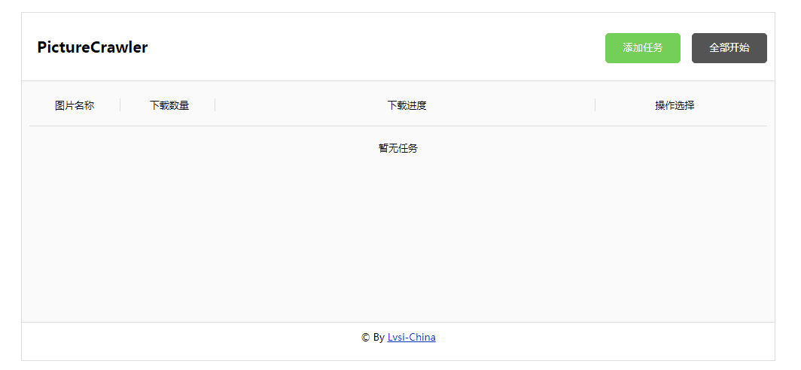
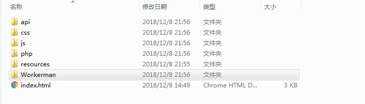
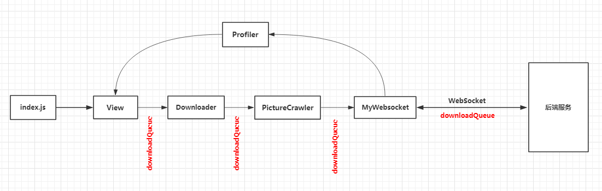

# PictureCrawler

<p align="center">


</p>

基于 PHP/NodeJS 的图片爬虫下载器（A Picture Crawler Based on PHP/NodeJS），[立即使用](#usage)

## ✎ 摘要( Synopsis )

PHP 版本实际效果如下



```
对于PHP版本，我使用的是 workerman，但是 workerman 在 Windows 上不支持多进程，
所以，这个效果图看到的3个并发下载还是在单进程里面执行的。
不过不用担心！只要你的系统是Linux系统，就会看到多进程并发下载的效果了。
```
## ♨ 介绍( Introduction )

项目会使用两个语言实现，分别是 PHP版本(已完成) 和 NodeJS版本(未完成)。

通过用户输入的关键字和图片数量，后台服务会使用CURL(PHP)抓取网页的内容，然后使用正则去分析出相关图片的URL，紧接着，再次使用CURL(PHP)根据图片的URL去读取图片的内容，然后存入本地文件。

## <span id="usage">♗ 使用</span>

#### (1) 对于PHP 版本

1. 下载本项目，并下载 [workerman](https://www.workerman.net/download)
2. 将下载的workerman放置到如下图所示的路径中。
<br/>
3. 开启本地 Apache 服务器。
4. 直接运行 index.html 文件，即可使用。

#### (2) 对于 NodeJS 版本

暂未完成。

## ✪ 功能( Features )

1. 根据输入的图片关键字和数量以实现自定义图片抓取和下载。
2. 多个下载任务使用多进程并行(并发)下载，提高下载效率。
3. 使用WebSocket与后端服务长连接通信，可视化查看每个下载任务的下载进度。
4. 后端服务会自动下载爬取到的图片，无需用户干预。
5. 提供 PHP 和 NodeJS 两种版本。
6. ... ...

## ✣ <span id="article-FrontEndArchitecture">前端架构图 ( Front end architecture )</span>

前端没有使用React等框架的大致架构如下



## ☑ 为什么有PHP和NodeJS两个语言版本 ( Why PHP & NodeJS ) ?

其实我之前想的只是用PHP去实现，但是发现 workerman 这个框架在 windows 上不支持多进程，对于 windows 也就无法实现并发下载，所以，为了弥补这个缺陷，就使用 NodeJS 去重新实现另一版。

## ☑ 为什么用 WebSocket ( Why websocket ) ?

- 在上传文件的场景中，Javascript的```XMLHttpRequest```提供了```progress```事件，这个事件会返回已上传文件的大小和总大小。当然当每次都有新的上传进度时，都会调用这个方法，在```progress```事件中，根据这两个值，就可以计算上传进度了，也就达到了可视化文件上传进度的效果。

- 但是本项目的场景毕竟不是文件上传啊！前端一般都是使用应用层的```HTTP协议```，由于```HTTP协议的无状态性```，我们好像无法实时获得后台的处理进度，怎么办呢？ 使用 websocket !

- 从效果截图看，会发现每一个下载任务都是有对应的下载进度的，传统的HTTP需要使用轮训才能实现这个功能，但轮训的代价太大，所以只能选择使用 Websocket 进行长连接通信。

## ✦ 关于爬图 ( About crawl pictures )

目前，我代码里面是直接爬的百度图片，而且，很多细节有待改进，比如有些图片无法成功读取并写入，增加下载的图片个数，等等，这些都是之后版本中在细节上需要优化的。

## ✦ 关于下载暂停 ( About download suspension )

先说一下实现的过程，当通过 Websocket 传输【下载消息】，后台接收到消息后就开始了。 此时，如果再点击暂停按钮的时候，会再次通过 Websocket 传输【暂停消息】，由于后台服务是多个不同的进程，因此，收到消息的可能是另一个进程。

很明显，此时又涉及到了进程之间的通信，请看下面。

## ✦ 关于进程间通信（ About IPC ）

常见的进程通信方式包括管道，消息队列和共享内存等，具体大家可以Google看看，我使用的是共享内存的方式，具体实现是通过 Redis 缓存系统实现的，每当进程收到【暂停消息】的时候，在缓存中将下载任务对应的状态置为暂停，然后另一个进程发现自己的状态为暂停，就不会再下载了。大致过程就是这样。

## ✦ 关于下载进度 ( About download progress )

#### JS如何获取下载进度？

后端服务每当下载完一个图片的时候，都会向前端发送消息(包括下载进度)。前端监听到消息之后(使用WebSocket协议)立即把原始未处理的消息传给```Profiler```，```Profiler```把数据解析后传给视图```View```，由视图更新( 如果还不明白，可以看 [前端架构图](#article-FrontEndArchitecture) )。经过这一系列的流程，即可实现下载进度可视化了。

关于后端PHP发送下载进度消息的代码如下：

```php
foreach ($matchs[1] as $img_url) {

	// 下载数量多于count时，退出( 爬到很多图片的情况 )
	if($downloadedCount>=$count){

		break;
	}

	++$downloadedCount;

	curlResource($img_url, $keyword, $downloadedCount, $taskId);

	$data[0]['downloadedCount'] = $downloadedCount;
	$connection->send(json_encode($data,JSON_UNESCAPED_UNICODE)); // 向浏览器发送
}
```

#### 进度条小组件

这个很简单，主要是通过设置进度条宽度为 ```(downloadedCount/count)*200``` 来实现的。具体的前端代码如下所示：

```css
/* task.css */
.visualCountContainer{

	margin-bottom: 7px;
}
.visualDownloadContainer{

	display: inline-block;
	border: 1px solid #DDD;
	background: #DDD;
	width: 200px;
	border-radius: 200px;
	height: 10px;
	text-align: left;
	line-height: 10px;
}

	.processBar{

		display: inline-block;
		border-radius: 200px;
		height:10px;
		background:#000;
	}
```

```html
<!-- index.html -->
<li class="col col-3">
	<div class="visualCountContainer">
		<span class="downloadedCount">0</span> / <span class="count">0</span>
	</div>
	<div class="visualDownloadContainer"><span class="processBar"></span></div>
</li>
```

```javascript
$(".task").eq(id).find(".visualDownloadContainer .processBar").css("width",(downloadedCount/count)*200);
$(".task").eq(id).find(".downloadedCount").text(downloadedCount);
$(".task").eq(id).find(".count").text(count);
```

## ✔ 发行版 ( Releases)
有 NodeJS 版本和 PHP 版本，具体的请见 [releases](https://github.com/WGrape/PictureCrawler/releases)
