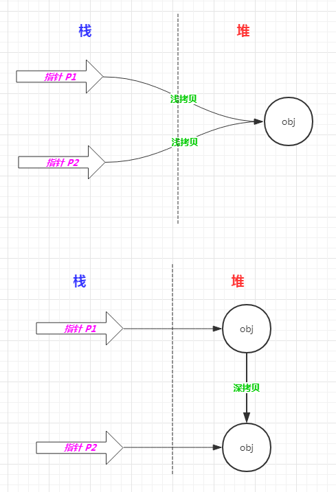

### 介绍深拷贝和浅拷贝

### 解释下内存中堆和栈，写一个stack overflow的代码

### session校验服务器该如何设计

### 32位整数-1右移两位是啥

### 解释下Cache的运行过程，怎么保证cache一致性

### 函数调用汇编 怎么传参数 函数a call b，参数放在哪个栈帧 

### GDB有用过哪些

### 数据库连接池的原理和实现？

### 什么是反射？原理是什么？如何实现反射？

### 什么是序列化？怎么实现对象的序列化和反序列化？

### 场景管理怎么做的？场景数据怎么保存怎么读取的？
序列化

### 变量和常量存放的位置

### 函数的种类有什么

### TypeHint ？

### 理解并实现自己的异步消息队列 ？

### 如何理解并实现自己的装饰器？

### 如何理解并实现自己的生成器？

### 什么是缓存击穿？

### 对于日志记录，同步操作好还是异步操作好？

### 怎样在多台Web服务器上共享Session

### 什么是 ODBC，JDBC

### crontab 原理

### 如何实现 crontab 每秒执行一次（ crontab 最小间隔为1分钟 ）
